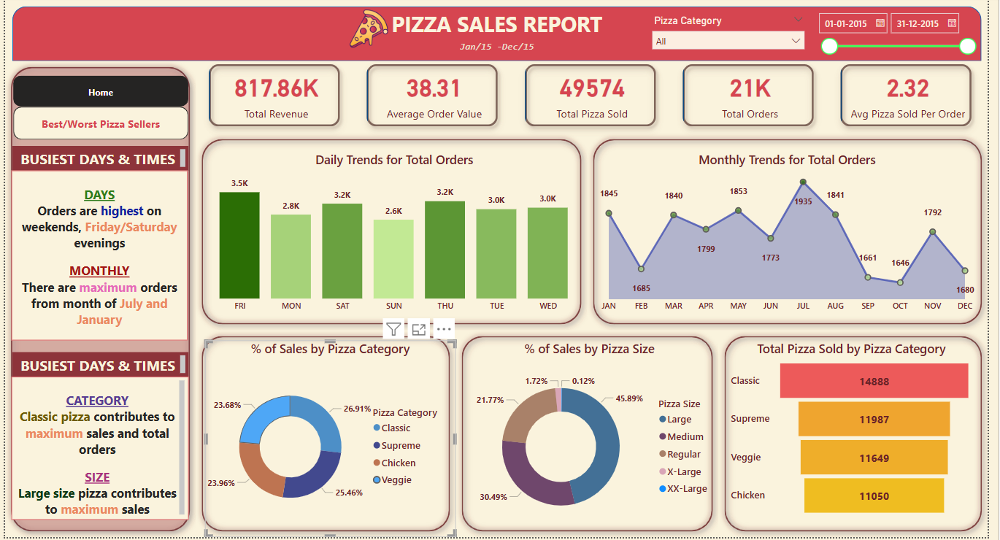
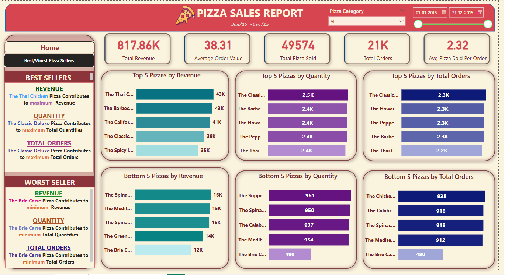

# 🍕 Pizza Sales Dashboard

A visually interactive **Power BI Dashboard** created for analyzing pizza sales data. This report breaks down sales by revenue, quantity, category, and size, helping identify top-selling pizzas and key business insights.

## 📊 Key Highlights

- **817K+ Total Revenue**
- **21K Orders Processed**
- **Top Sellers:** Thai Chicken, Classic Deluxe
- **Best Sales Days:** Fridays & Saturdays
- **Peak Months:** July and January

## 🔍 Dashboard Overview

### 🖼 Preview 1

### 🖼 Preview 2

## 🛠 Tools Used

- **Power BI**
- **SQL / M Query Language**
- **Pizza Sales Dataset (CSV)**

## 📂 Files Included

- `pizza_queries.sql` – SQL or Power Query M used for data cleaning and modeling
- `pizza-dashboard-1.png` – Screenshot of main dashboard
- `pizza-dashboard-2.png` – Screenshot of best/worst sellers analysis

---

## 📌 Insights Delivered

- **Best/Worst Pizzas:** Sorted by revenue, orders, and quantity
- **Sales Breakdown:** By pizza category and size
- **Trends:** Daily and monthly order patterns

---

> This project showcases my ability to turn raw data into visually appealing business insights. Great for showcasing Power BI skills to recruiters!
